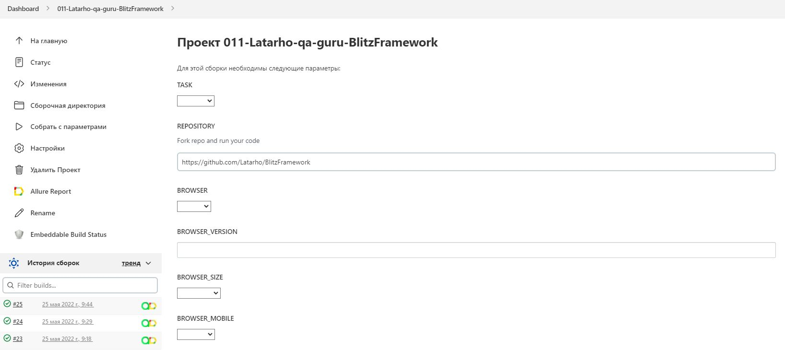
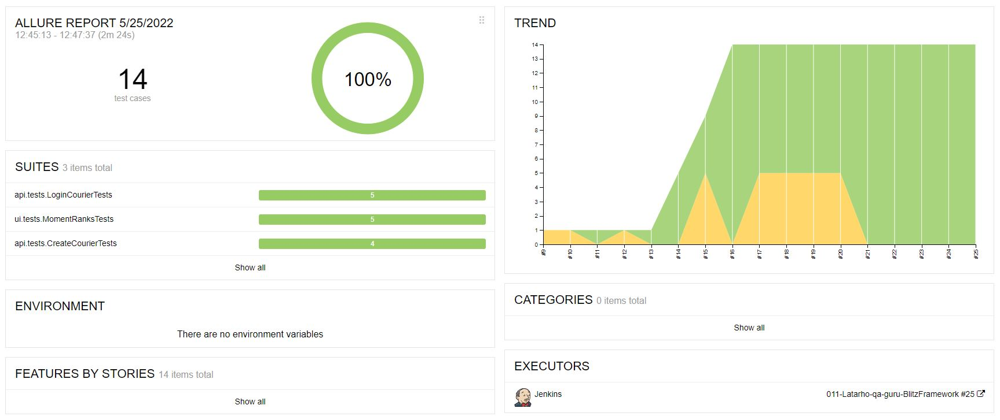
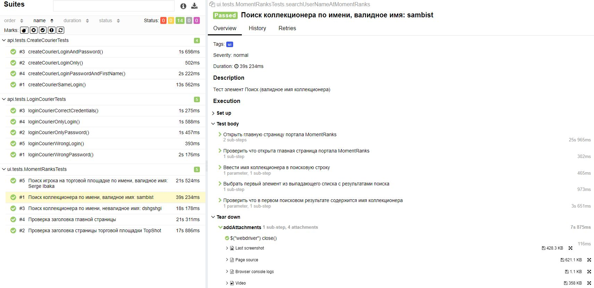
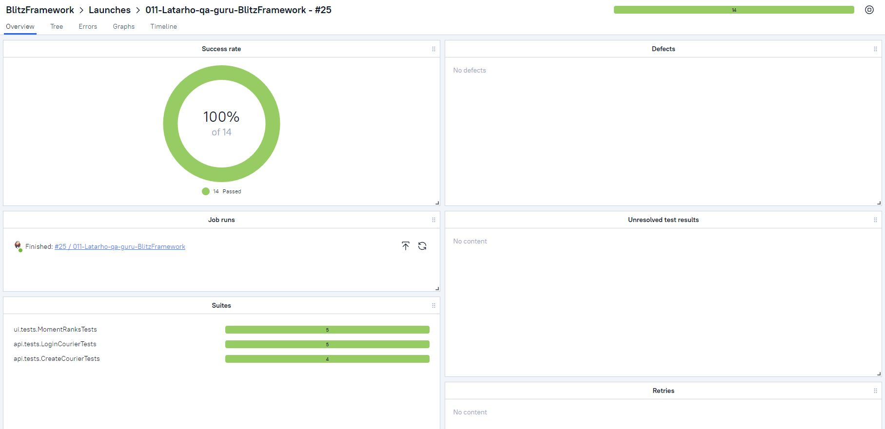
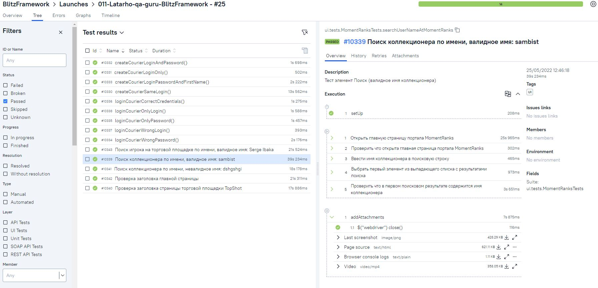
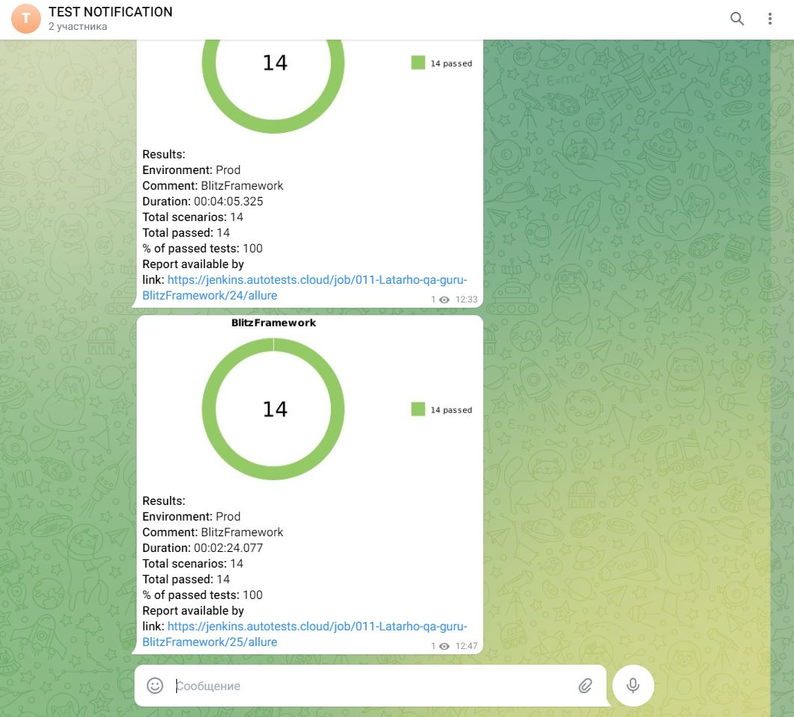

# Проект по автоматизации тестирования для <a target="_blank" href="https://momentranks.com/">MomentRanks</a> и публичного API <a target="_blank" href="https://qa-scooter.praktikum-services.ru/api/v1">QA-Scooter</a>

## 📃 Содержание:

- [Технологии и инструменты](#computer-технологии-и-инструменты)
- [Реализованные проверки](#boom-Реализованные-проверки)
- [Сборка в Jenkins](#-сборка-в-jenkins)
- [Запуск из терминала](#computer-Запуск-тестов-из-терминала)
- [Отчет в Allure report](#-отчет-в-allure-report)
- [Отчет в Telegram](#-уведомление-в-telegram-при-помощи-бота)
- [Видео пример прохождения тестов](#-видео-пример-прохождения-теста)

## :computer: Технологии и инструменты
<p align="center">


 
</p>

## :boom: Реализованные проверки
### &nbsp;&nbsp;&nbsp; UI
>- [x] Проверка заголовка главной страницы
>- [x] Поиск коллекционера по имени, валидное имя
>- [x] Поиск коллекционера по имени, невалидное имя
>- [x] Проверка заголовка страницы торговой площадки TopShot
>- [x] Поиск игрока на торговой площадке по имени, валидное имя
### &nbsp;&nbsp;&nbsp; API
>- [x] Создание курьера (все поля заполнены корректными значениями)
>- [x] Создание курьера (только логин и пароль)
>- [x] Создание курьера (только логин)
>- [x] Создание курьера (совпадающие логины)
>- [x] Авторизация (корректные креды)
>- [x] Авторизация (корректные креды, только логин)
>- [x] Создание курьера (корректный логин, некорректный пароль)

## </a> Сборка в Jenkins
<a target="_blank" href="https://jenkins.autotests.cloud/job/011-Latarho-qa-guru-BlitzFramework/">Jenkins job</a>
<p align="center">
<a href="https://jenkins.autotests.cloud/job/C11-eisritter-UI-and-API/"></a>
</p>

### :maple_leaf: Параметры сборки в Jenkins:

- browser (браузер, по умолчанию chrome)
- browserSize (размер окна браузера, по умолчанию 1920x1080)
- remoteDriverUrl (логин, пароль и адрес удаленного сервера selenoid или grid)
- threads (количество потоков)
- AlureNotificationVersion (версия AllureNotification)

## :computer: Запуск тестов из терминала

Локальный запуск:
```
gradle clean test
```

Удаленный запуск:
```
clean
test
-Dbrowser=${BROWSER}
-DbrowserVersion=${BROWSER_VERSION}
-DbrowserSize=${BROWSER_SIZE}
-DbrowserMobileView="${BROWSER_MOBILE}"
-DremoteDriverUrl=https://${USER}:${PASSWORD}@${REMOTE_DRIVER_URL}/wd/hub/
-DvideoStorage=https://${REMOTE_DRIVER_URL}/video/
-Dthreads=${THREADS}
```
## </a> Отчет в <a target="_blank" href="https://jenkins.autotests.cloud/job/011-Latarho-qa-guru-BlitzFramework/allure/">Allure report</a>

### :lady_beetle: Основное окно

<p align="center">

</p>

### :cherries: Тесты

<p align="center">

</p>

## </a> Отчет в <a target="_blank" href="https://allure.autotests.cloud/launch/12998/?search=W3siaWQiOiJzdGF0dXMiLCJ0eXBlIjoidGVzdFN0YXR1c0FycmF5IiwidmFsdWUiOlsicGFzc2VkIl19XQ%3D%3D&treeId=0">Allure TestOps</a>

### :lady_beetle: Результаты запуска тестов

<p align="center">

</p>

### :cherries: Тест-кейсы

<p align="center">

</p>

## </a> Уведомление в Telegram при помощи бота

<p align="center">

</p>


## </a> Видео пример прохождения UI теста

<p align="center">
 
</p>
